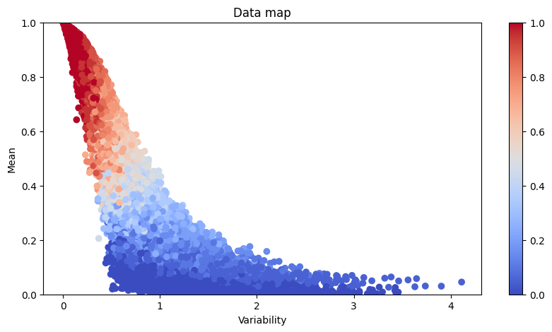

# Experimental Report on Dataset Segmentation and Retraining Using CNN Model Confidence and Correctness

## Introduction

This report presents an experimental study on the effectiveness of using Convolutional Neural Network (CNN) model confidence and correctness to segment datasets and retrain models. The primary objective was to explore whether this approach could enhance model performance compared to a standard ResNet18 architecture.

## Methodology

Our experiment consisted of three main phases: model evaluation, data segmentation, and model retraining.

In the model evaluation phase, we utilized a pre-trained CNN model, likely a ResNet18, to assess the training data. For each sample in the dataset, we calculated two key metrics: confidence and correctness. Confidence was derived from the softmax probabilities of the model's output, while correctness was determined by comparing the model's predictions with ground truth labels. This evaluation process was repeated over multiple training epochs to ensure robustness.

The data segmentation phase involved categorizing the dataset into three distinct groups based on the mean values of confidence and correctness:

- Type A: Low confidence (≤ 0.2) and low correctness (≤ 0.4)
- Type B: Medium confidence (0.2 < x ≤ 0.6) and medium correctness (0.4 < x ≤ 0.6)
- Type C: High confidence (> 0.6) and high correctness (> 0.6)

For the model retraining phase, we initialized three new ResNet18 models, each corresponding to one of the data types (A, B, and C). These models were trained independently using their respective data subsets. We employed the AdamW optimizer enhanced with the Lookahead technique to optimize the training process. Each model underwent 20 epochs of training.

## Results and Discussion

Our experimental results revealed an intriguing outcome. The original ResNet18 model achieved an accuracy of 60.98%, while the newly trained "chimera" model, which combined the three retrained models, yielded an accuracy of 34.08%.

Contrary to our initial expectations, the segmentation and retraining approach led to a significant decrease in overall accuracy. This unexpected result prompts several points for discussion:

1. Data Imbalance: The segmentation process may have resulted in imbalanced datasets for each model, potentially leading to overfitting on smaller subsets or underfitting on larger ones.

2. Loss of Generalization: By training models on specific subsets of data, we might have inadvertently reduced their ability to generalize across the entire dataset.

3. Interaction Effects: The original model might have benefited from learning interactions between different types of data, which was lost in the segmented approach.

4. Ensemble Effects: The method of combining predictions from the three models (the "chimera" approach) may need refinement to leverage the strengths of each specialized model effectively.

## Conclusion and Future Work

While our experiment did not yield the anticipated improvement in accuracy, it has provided valuable insights into the complexities of data segmentation and model specialization. Future work could explore alternative segmentation criteria, investigate more sophisticated ensemble methods, or consider a curriculum learning approach where models are exposed to increasingly difficult data subsets during training.

Additionally, a more in-depth analysis of each segmented model's performance on its specific data type could provide further insights. It may also be beneficial to experiment with different architectures or transfer learning techniques that might be more suitable for this segmented approach.

In conclusion, while the current results did not show an improvement, this experiment has opened up new avenues for research in the field of targeted model training and data segmentation strategies.